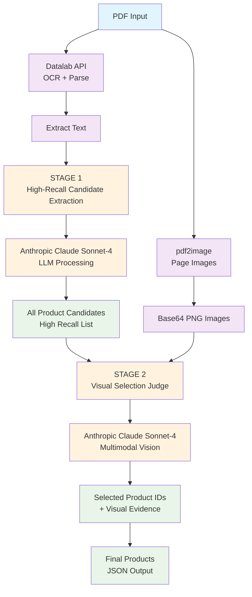

# System Architecture

## Overview
A two-stage AI pipeline for extracting selected product variants from construction submittal PDFs using LLM + vision capabilities.

## Architecture Diagram

### ASCII Diagram
```
┌─────────────────┐    ┌─────────────────┐    ┌─────────────────┐
│   PDF Input     │    │  Text Content   │    │  Page Images    │
│                 │    │                 │    │                 │
└─────────┬───────┘    └─────────┬───────┘    └─────────┬───────┘
          │                      │                      │
          ▼                      │                      │
┌─────────────────┐              │                      │
│   Datalab API   │──────────────┘                      │
│  (OCR + Parse)  │                                     │
└─────────┬───────┘                                     │
          │                                             │
          ▼                                             │
┌─────────────────┐                                     │
│   STAGE 1       │◄────────────────────────────────────┘
│ High-Recall     │
│ Candidate       │    ┌─────────────────┐
│ Extraction      │    │  Anthropic API  │
│ (LLM)           │───►│ Claude Sonnet-4 │
└─────────┬───────┘    └─────────────────┘
          │
          ▼
┌─────────────────┐
│  All Product    │
│  Candidates     │
│  (High Recall)  │
└─────────┬───────┘
          │
          ▼
┌─────────────────┐    ┌─────────────────┐
│   STAGE 2       │    │  Page Images    │
│ Visual Judge    │◄───┤ (Base64 PNG)    │
│ (Multimodal)    │    └─────────────────┘
└─────────┬───────┘
          │
          ▼
┌─────────────────┐    ┌─────────────────┐
│ Selected IDs    │    │  Final Products │
│ + Evidence      │───►│ (JSON Output)   │
└─────────────────┘    └─────────────────┘
```

### Mermaid Diagram


## Component Details

### 1. **PDF Processing Layer**
- **Datalab API**: OCR + structured text extraction
- **pdf2image**: Convert pages to base64-encoded images
- **Caching**: Local cache to avoid reprocessing

### 2. **Stage 1: Candidate Extraction**  
- **High-recall LLM pass** using Claude Sonnet-4
- Extracts **ALL** product variants from text
- Domain-aware prompting for construction submittals
- Output: List of all possible products

### 3. **Stage 2: Visual Selection**
- **Multimodal LLM pass** using Claude Vision
- Analyzes page images for visual annotations
- Supports highlights (60%), boxes (30%), circles (10%)
- Output: Selected indices + evidence

### 4. **Evaluation & Observability**
- **Logfire**: Real-time LLM call monitoring  
- **Precision/Recall/F1**: Automated evaluation
- **Ground Truth**: Expected outputs for validation

### 5. **Interfaces**
- **CLI**: `python cli.py document.pdf`
- **Gradio Dashboard**: Interactive web interface
- **Modular API**: Clean separation of concerns

## Data Flow

```
PDF → [Datalab] → Text + Images → [Stage 1] → Candidates → [Stage 2] → Selected Products
                                    ↓                        ↓
                                 All Items              Visual Evidence
```

## Production Considerations

### **Scalability**
- Async processing for multiple documents
- Queue-based architecture for high throughput
- Distributed caching with Redis

### **Reliability**  
- Circuit breakers for external APIs
- Retry logic with exponential backoff
- Graceful degradation (text-only mode)

### **Monitoring**
- **Logfire** for LLM observability
- **Metrics**: latency, accuracy, cost per document
- **Alerting**: API failures, accuracy drops

### **Cost Optimization**
- Caching strategy (~$0.10/document target)
- Model selection (Claude vs GPT-4V)
- Batch processing for efficiency

### **Human-in-the-Loop**
- Confidence thresholds for review
- Ambiguous annotation flagging
- Quality assurance workflows

## Technology Stack

- **Runtime**: Python 3.9+
- **LLM**: Anthropic Claude Sonnet-4
- **PDF Processing**: Datalab Marker API
- **Image Processing**: pdf2image, PIL
- **Web Interface**: Gradio
- **Observability**: Logfire
- **Data Models**: Pydantic